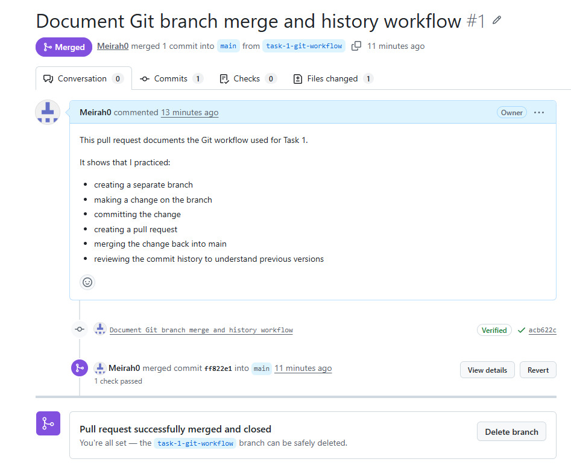
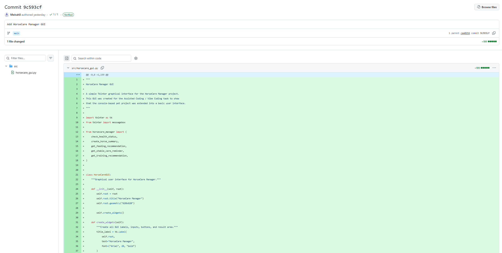
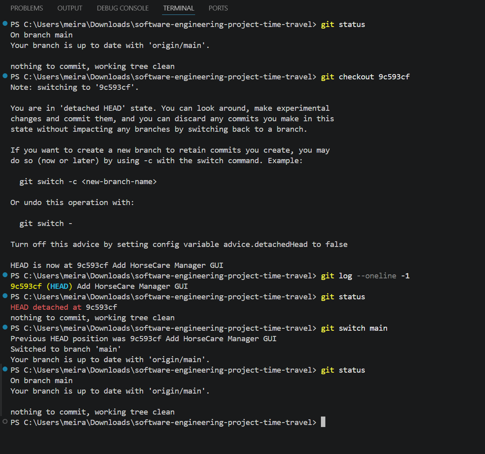

# Task 1 – Git

## Goal

The goal of this task is to demonstrate practical use of Git version control within the Software Engineering project.

This documentation covers:

* Repository usage
* Commit history
* Branch workflow
* Pull Request and merge process
* Commit history review
* Git time travelling using `git checkout`

Git was used to organize the project work, track changes, document development progress, and manage different project states.

## Repository Used

This task is based on the main Software Engineering project repository:

```text
software-engineering-project
```

The repository contains the project documentation, source code, screenshots, tests, workflow files, and task folders.

## Git Workflow Overview

During the project, Git was used to manage changes step by step.

The workflow included:

1. Updating project files and documentation
2. Checking the repository status
3. Adding changed files
4. Creating commits with meaningful commit messages
5. Creating a separate branch for Git workflow documentation
6. Opening a Pull Request
7. Merging the branch back into `main`
8. Reviewing previous commits
9. Checking out a specific older commit
10. Returning safely to the current `main` branch

## Git Commands Used

The following Git commands were used during this task:

```bash
git status
git add .
git commit -m "message"
git branch
git checkout <commit-id>
git log --oneline -1
git switch main
```

These commands were used to inspect the repository state, track changes, review history, move to an older commit, and return to the current branch.

## Branch and Merge Workflow

To demonstrate branch-based development, I created a separate branch for the Git workflow documentation.

The branch workflow followed these steps:

1. Start from the `main` branch
2. Create a separate branch
3. Make changes on the branch
4. Commit the changes
5. Open a Pull Request
6. Merge the Pull Request back into `main`

This workflow demonstrates how Git can be used to separate changes from the main project until they are reviewed and merged.

## Branch and Merge Screenshot

This screenshot shows the Pull Request that was successfully merged back into the `main` branch.



## Commit History Review

Before applying Git time travelling locally, I reviewed the GitHub commit history to identify a suitable older commit ID.

The selected commit was:

```text
9c593cf
```

Commit message:

```text
Add HorseCare Manager GUI
```

This commit was used as the target commit for the checkout-based time travelling example.



## Git Time Travelling with Checkout

For Git time travelling, I used `git checkout` with a specific commit ID from my own repository.

The command used was:

```bash
git checkout 9c593cf
```

This command temporarily moved the repository to an older project state. Git showed the repository in a `detached HEAD` state, which means the working directory was no longer on the latest `main` branch but on the selected older commit.

To verify the selected commit, I used:

```bash
git log --oneline -1
```

The command confirmed the active commit:

```text
9c593cf Add HorseCare Manager GUI
```

After reviewing the older project state, I returned to the current main branch using:

```bash
git switch main
```

Finally, I checked the repository state again with:

```bash
git status
```

This confirmed that the repository was back on `main` and that the working tree was clean.

## Time Travelling Screenshot

This screenshot documents the complete checkout-based Git time travelling process:

1. Starting from the `main` branch
2. Checking out the older commit `9c593cf`
3. Entering the detached HEAD state
4. Verifying the selected commit with `git log --oneline -1`
5. Returning to `main` using `git switch main`
6. Confirming the clean repository state with `git status`



## Technical Understanding

This task demonstrates that Git can be used not only for saving project progress, but also for navigating through previous project states.

The branch and merge workflow shows how changes can be developed separately and then integrated back into the main branch through a Pull Request.

The checkout-based time travelling example shows how a specific older commit can be opened locally by using its commit ID. The detached HEAD state confirms that the repository is temporarily viewing an earlier version of the project. Returning with `git switch main` restores the working directory to the current main branch.

## Summary

This task documents the practical Git workflow used in the project:

* A branch was created and merged through a Pull Request.
* Commit history was reviewed to identify an older project state.
* A specific commit ID was checked out using `git checkout`.
* The detached HEAD state was documented.
* The repository was returned safely to the `main` branch.

Together, these steps demonstrate version control, branch workflow, merge workflow, and basic Git time travelling.
