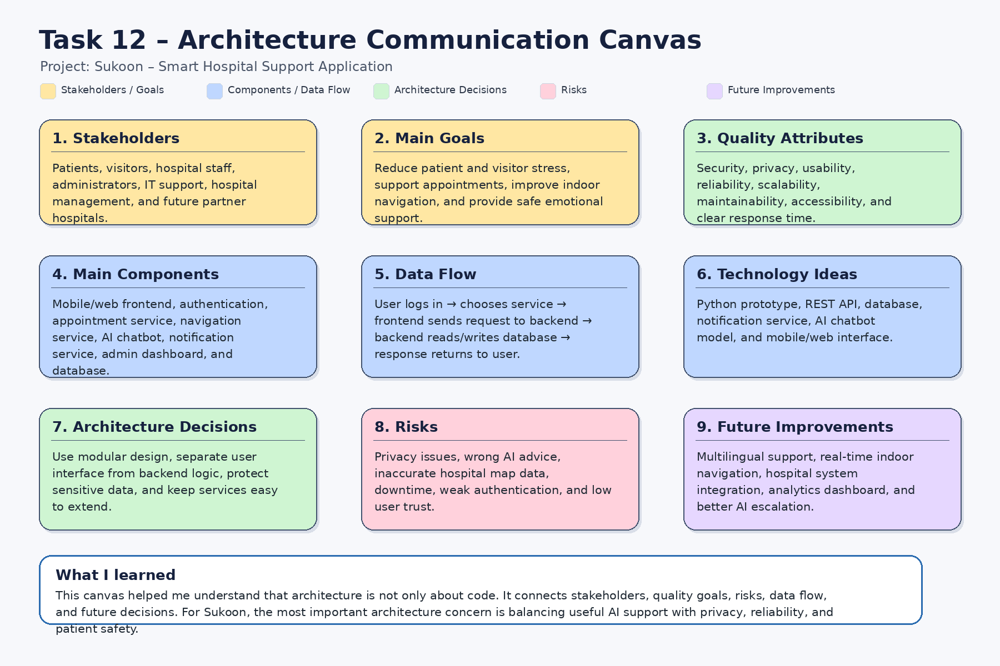

# Task 12 – Architecture

## Project
Sukoon – Smart Hospital Support Application

## Task Description
The goal of this task was to think like a software architect and document important architecture aspects for a future software project. Instead of only creating a simple checklist, I created an Architecture Communication Canvas for the Sukoon project.

This canvas explains the most important architecture elements such as stakeholders, system goals, quality attributes, components, data flow, technology ideas, risks, architecture decisions, and future improvements.

## Architecture Communication Canvas

## Explanation

The Sukoon system is designed as a smart hospital support application for patients and visitors. The main goal is to reduce stress inside hospitals by supporting appointment management, indoor navigation, reminder notifications, and AI-based emotional support.

The architecture separates the system into different parts such as the frontend, authentication, appointment service, navigation service, AI chatbot, notification service, admin dashboard, and database. This makes the system easier to understand, test, maintain, and extend in the future.

Important quality attributes for this system include privacy, security, usability, reliability, scalability, and maintainability. These are important because the application deals with hospital users and potentially sensitive user information.

## Architecture Risks

The main risks are privacy problems, wrong AI advice, inaccurate hospital map data, system downtime, weak authentication, and low user trust. These risks must be considered early because they can affect patient safety, user experience, and the credibility of the application.

## Architecture Decisions

For this project, I would use a modular architecture. The user interface, backend logic, database, AI chatbot, and notification system should be separated. This makes it easier to change one part of the system without breaking everything else.

I would also keep the AI support limited and safe. The chatbot should provide emotional support and guidance, but serious medical or emergency situations should be escalated to hospital staff.

## What I Learned

This task helped me understand that software architecture is not only about choosing technologies. It is also about understanding users, risks, quality goals, communication between components, and future system growth.

I learned that a good architecture should make the system easier to maintain, safer to use, and easier to explain to both technical and non-technical stakeholders.
