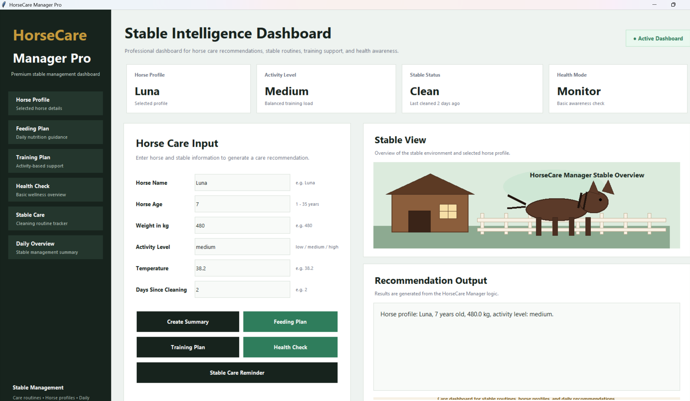
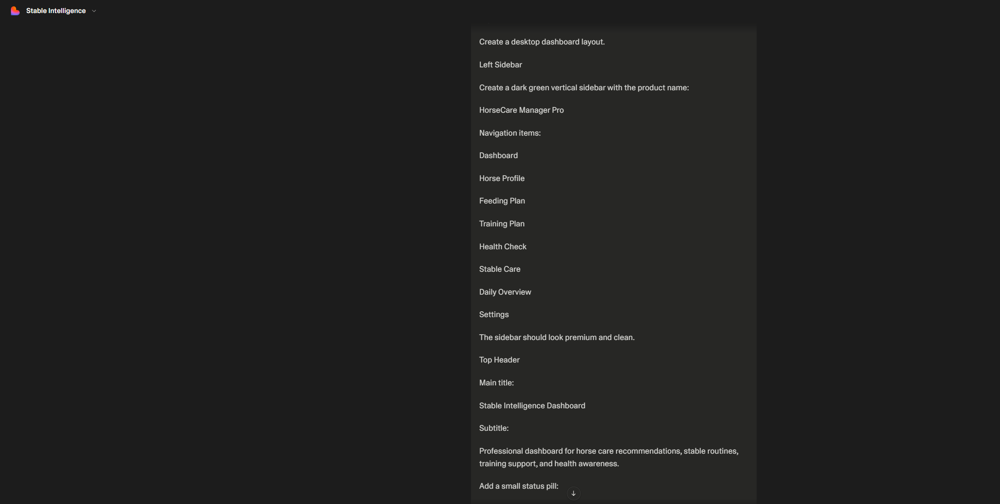
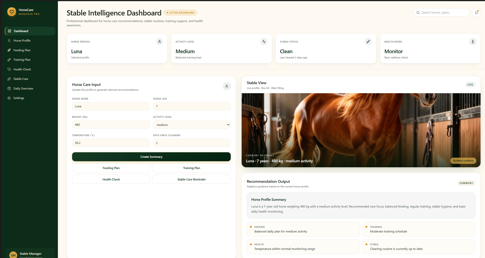

# Task 13 – Assisted / Vibe Coding

## Course Requirement Reference

In the course task sheet, this section is described as the Assisted / Vibe / Agentic Coding task.
In this repository, I documented it as Task 13 to keep it clearly separated from Task 12 – Architecture.

## Goal

The goal of this task is to document how assisted and vibe coding were used during the development of the practical coding part of this Software Engineering project.

For this task, I used assisted coding as a support method to plan, structure, improve, and visually extend the **HorseCare Manager** project. The final result was reviewed, adapted, implemented, tested, and documented in GitHub.

This task includes:

1. A GUI extension for the Python project
2. A Lovable-vibed dashboard prototype for the bigger pet project
3. A modular Python implementation with tests, build commands, and CI workflow
4. Step-by-step documentation of the development process and code understanding

## Project Used

The assisted coding work is based on the improved pet project:

```text
HorseCare Manager
```

HorseCare Manager is a horse and stable care support project. It includes horse profile summaries, feeding recommendations, training recommendations, basic health checks, and stable cleaning reminders.

Source code:

[Open HorseCare Manager source code](../../src/horsecare_manager.py)

GUI code:

[Open HorseCare Manager GUI](../../src/horsecare_gui.py)

Test file:

[Open HorseCare Manager tests](../../tests/test_horsecare_manager.py)

Related tasks:

* [Task 6 – Clean Code](../task-6-clean-code)
* [Task 7 – Refactoring](../task-7-refactoring)
* [Task 8 – Testing](../task-8-testing)
* [Task 9 – Build Management](../task-9-build-management)
* [Task 10 – Continuous Delivery](../task-10-continuous-delivery)

## Assisted Coding Scope

This task covers three main parts:

1. **Part A – GUI Extension**
   A visual GUI was created for the HorseCare Manager project.

2. **Part B – Lovable Vibe Coding Prototype**
   A professional web dashboard prototype was created using Lovable to show the bigger pet project as a polished product-style interface.

3. **Part C – Modular Python Implementation and Documentation**
   The Python project was implemented with separate source code, tests, build commands, requirements, and GitHub Actions workflow.

The work was not treated as one single generated result. It was developed step by step, reviewed, adapted, tested, and documented inside GitHub.

## Part A – GUI Extension

A graphical user interface was created for the HorseCare Manager project.

GUI file:

[Open HorseCare Manager GUI](../../src/horsecare_gui.py)

The GUI was created with Python `tkinter` and includes input fields for:

* Horse name
* Horse age
* Horse weight
* Activity level
* Temperature
* Days since stable cleaning

The GUI includes buttons for:

* Creating a horse summary
* Getting a feeding recommendation
* Getting a training recommendation
* Running a basic health check
* Getting a stable care reminder

This extends the console-based project into a more visual and user-friendly form. The GUI also helps demonstrate how the same project logic can be reused in a different interface.

## Part B – Lovable Vibe Coding Prototype

For Part B, I created the bigger HorseCare Manager project as a visual web app prototype using **Lovable**.

The goal was to show the project as a professional dashboard-style product and not only as Python source code. I used Lovable to create a premium stable-management dashboard concept for HorseCare Manager Pro.

The Lovable prototype includes:

* A dark green navigation sidebar
* Dashboard overview cards
* Horse profile information
* Care input fields
* A realistic stable view
* Recommendation output
* Professional product-style layout
* Clean visual design suitable for a presentation

This part demonstrates the vibe coding aspect of the task because the dashboard was created from a descriptive prompt and then reviewed visually.

## Part C – Modular Python Implementation

In addition to the Lovable prototype, I also implemented the HorseCare Manager concept as a modular Python project.

Important project files:

| File                                                                     | Purpose                    |
| ------------------------------------------------------------------------ | -------------------------- |
| [src/horsecare_manager.py](../../src/horsecare_manager.py)               | Main project logic         |
| [src/horsecare_gui.py](../../src/horsecare_gui.py)                       | GUI extension              |
| [tests/test_horsecare_manager.py](../../tests/test_horsecare_manager.py) | Unit tests                 |
| [Makefile](../../Makefile)                                               | Build and quality commands |
| [requirements.txt](../../requirements.txt)                               | Python dependencies        |
| [.github/workflows/python-ci.yml](../../.github/workflows/python-ci.yml) | GitHub Actions workflow    |

This shows that the project is not only a visual concept, but also connected to executable source code and software engineering practices.

## Development Tools and Process

The project was developed and documented using:

* GitHub
* Visual Studio Code
* Python
* Tkinter
* Pytest
* Pylint
* Radon
* Makefile
* GitHub Actions
* Lovable

The practical work includes:

* Python source code
* GUI file
* Unit tests
* Requirements file
* Makefile
* GitHub Actions workflow
* Lovable dashboard prototype
* Markdown documentation
* Screenshots showing the project running

## Assisted Coding Process

The development process was done step by step.

The process included:

1. Starting with a simple pet project idea
2. Deciding to create a stronger project for the technical tasks
3. Choosing a horse-care domain
4. Creating the first Python structure
5. Separating the logic into clear functions
6. Adding constants and validation
7. Adding error handling
8. Adding unit tests
9. Adding a Makefile
10. Adding a GitHub Actions workflow
11. Adding a GUI extension
12. Creating a Lovable dashboard prototype
13. Documenting the code understanding and development process in GitHub

## Example Prompts Used

The following prompts were used as support during the development process.

### Prompt 1 – Project Idea

```text
Create a small Python console project idea related to horses. The project should be simple enough for a Software Engineering pet project, but it should include enough logic for clean code, refactoring, and testing examples.
```

### Prompt 2 – Code Structure

```text
Help me structure a Python console application called HorseCare Manager. It should include functions for horse profile summary, feeding recommendation, training recommendation, health status check, and stable cleaning reminder.
```

### Prompt 3 – Clean Code Improvement

```text
Review the HorseCare Manager code and suggest how to make it cleaner using meaningful function names, constants, input validation, clear error messages, and smaller functions.
```

### Prompt 4 – Refactoring

```text
Show two refactoring examples from this Python project. One example should extract validation logic, and another should split one long script into smaller functions.
```

### Prompt 5 – Testing

```text
Create pytest unit tests for the HorseCare Manager functions. Include normal behavior tests, an exception test, and a type error test.
```

### Prompt 6 – Build and CI

```text
Create a simple Makefile and GitHub Actions workflow for a Python project that runs pytest, pylint, and radon metrics.
```

### Prompt 7 – GUI Extension

```text
Create a Python tkinter GUI for HorseCare Manager. The GUI should use the existing functions and include fields for horse name, age, weight, activity level, temperature, and stable cleaning days. The interface should look like a professional dashboard.
```

### Prompt 8 – Lovable Dashboard Prototype

```text
Build a high-end professional web app prototype called HorseCare Manager Pro.

The app is for stable and horse care management. It should look like a modern dashboard, not a simple form.

The design should use a deep forest green sidebar, cream background, white dashboard cards, muted gray text, gold accent details, soft shadows, rounded cards, elegant spacing, and realistic horse and stable visual elements.

The dashboard should include horse profile information, feeding plan, training plan, health check, stable care reminder, input fields, action buttons, stable view, and recommendation output.
```

## Code Understanding

The main functions in the project are:

* `validate_horse_age()` checks whether the horse age is valid.
* `validate_weight()` checks whether the horse weight is valid.
* `get_feeding_recommendation()` returns a feeding plan based on activity level.
* `get_training_recommendation()` returns a training recommendation based on age and activity.
* `check_health_status()` returns a basic health status message.
* `get_stable_care_reminder()` returns a stable cleaning reminder.
* `create_horse_summary()` creates a short horse profile summary.
* `run_console_app()` handles the console interaction.
* `HorseCareDashboard` creates the graphical user interface.

## What Was Improved

After using assisted coding support, the project was improved in several ways:

1. The code was separated into clear functions.
2. Constants were added for fixed values such as horse age limits and fever temperature.
3. Input validation was added for horse age, weight, temperature, and stable cleaning days.
4. Clear error messages were added.
5. Unit tests were created for important behavior.
6. A Makefile was added for build management.
7. A GitHub Actions workflow was added for automated checks.
8. A GUI was created to extend the console project.
9. A Lovable dashboard prototype was created to show the bigger pet project visually.
10. Screenshots were added so the results can be reviewed directly in GitHub.

## Limitations

The project is an educational software engineering prototype. It focuses on demonstrating software engineering concepts such as modular structure, GUI development, testing, build management, CI workflow, and assisted coding.

The care recommendations are simplified and are used to demonstrate application logic within the project. A real stable management system would require expert validation, more detailed horse and stable data, user accounts, database storage, and professional domain review.

## Reflection

This task helped me understand how assisted coding and vibe coding can support software development when they are used step by step.

The most useful part was not only generating code, but improving the structure, understanding the functions, writing tests, creating a GUI, and connecting the code to the Software Engineering tasks.

Using Lovable helped me understand how a project idea can be turned into a visual dashboard prototype quickly. The Python implementation helped me understand the logic behind the project and how the concept can be connected to actual code.

I learned that assisted coding should not replace understanding. It is more useful when it supports planning, structure, testing, visual prototyping, and documentation while the developer still reviews and adapts the result.

## Practical Screenshots and Lovable Prototype

### Part A – GUI Running

This screenshot shows the HorseCare Manager Pro dashboard running as a visual GUI. The interface includes horse profile inputs, care actions, stable overview, and recommendation output.



---

### Part B – Lovable Vibe Coding Prototype

For Part B, I created the bigger HorseCare Manager project as a visual web app prototype using Lovable. The goal was to show the project as a professional dashboard-style product with a polished interface.

I used Lovable to generate a premium stable-management dashboard for HorseCare Manager Pro. The prototype includes a sidebar, dashboard cards, horse profile information, care input fields, a realistic stable view, and recommendation output.

#### Lovable Prompt Screenshot

This screenshot shows part of the Lovable prompt used to create the dashboard prototype.



#### Lovable Dashboard Result

This screenshot shows the generated Lovable dashboard prototype for HorseCare Manager Pro.


