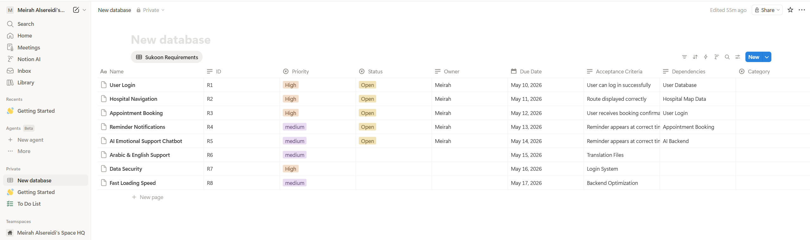
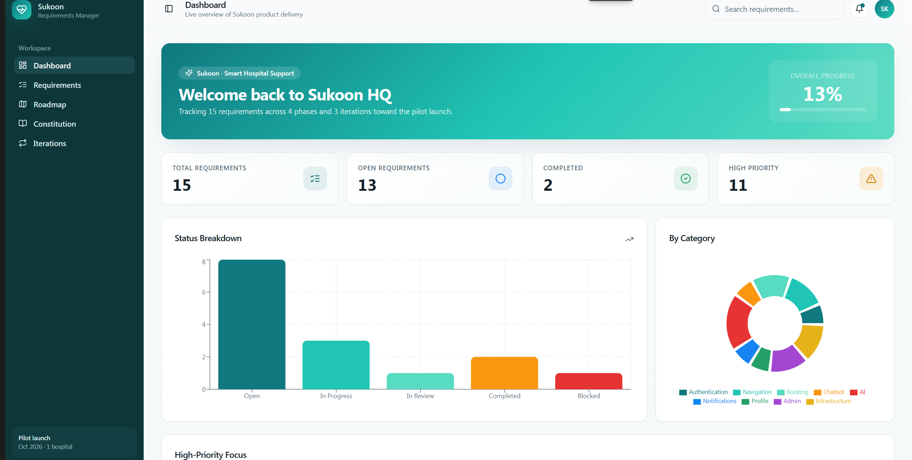
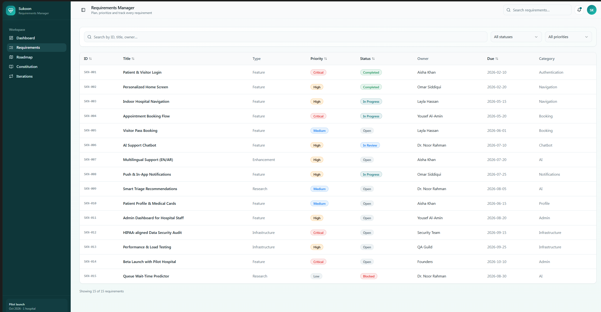
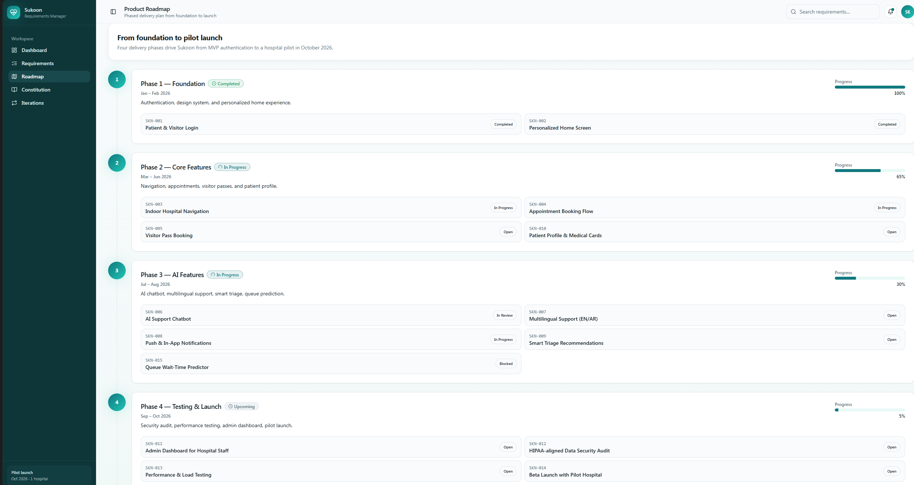
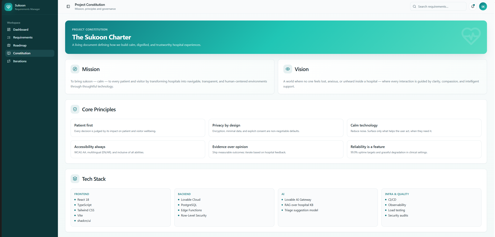
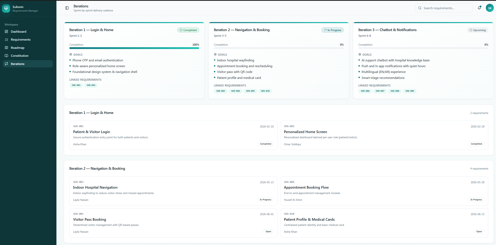

# Task 2 – Requirements Engineering

## Project
**Sukoon – Smart Hospital Support Application**

Sukoon is a smart hospital support application designed to reduce stress for patients and visitors by providing digital hospital navigation, appointment support, reminders, and emotional AI support.

---

## Part A – Simple Requirements Management Tool

### Tool Used
For Part A, I used **Notion** as a simple requirements management tool.

### What I Created
I created a structured requirements database for the Sukoon project. The database includes 5–10 software requirements, such as:

- User Login
- Hospital Navigation
- Appointment Booking
- Reminder Notifications
- AI Emotional Support Chatbot

### Requirement Attributes Used
Each requirement was documented using several attributes:

- Requirement ID
- Requirement Title
- Description
- Priority
- Status
- Owner
- Due Date
- Acceptance Criteria
- Dependencies

### Screenshot

Add your Notion screenshot here:

---

## Part B – Professional / AI-Based Requirements Tool

### Tool Used
For Part B, I used **Lovable AI** to build a custom professional requirements management platform called:

**Sukoon Requirements Hub**

### Why I Used AI
Instead of using a standard professional tool such as Jira or Monday, I created a custom solution with AI. This allowed me to design a tool specifically for the needs of the Sukoon startup project.

### AI Usage
I used Lovable AI to generate the first version of the web application. I provided prompts describing the purpose of the platform, the required pages, and the project context. The AI helped create the structure, user interface, and modules for the requirements hub.

### Main Modules Created
The custom platform includes:

1. **Dashboard**  
   Overview of total requirements, open requirements, completed requirements, high-priority tasks, and overall progress.

2. **Requirements Module**  
   A professional table to manage software requirements with attributes and status tracking.

3. **Roadmap**  
   A structured overview of planned project phases.

4. **Constitution**  
   Mission, principles, governance, and product direction.

5. **Iterations**  
   Planned development cycles for the first product releases.

## Screenshots

### Part A – Notion Requirements Table

### Part B – Dashboard

### Part B – Requirements Module

### Part B – Roadmap

### Part B – Constitution

### Part B – Iterations

---

## Part C – Constitution, Specification and Validation Documents

For Part C, I created a project constitution and the first specification and validation documents for the first development iterations.

### Constitution Files
- [Mission](mission.md)
- [Roadmap](roadmap.md)

### Iteration Files
- [Feature 1 – Smart Hospital Navigation](feature1.md)
- [Validation 1 – Smart Hospital Navigation](validation1.md)
- [Feature 2 – Appointment and Reminder Support](feature2.md)
- [Validation 2 – Appointment and Reminder Support](validation2.md)
- [Feature 3 – AI Emotional Support Chatbot](feature3.md)
- [Validation 3 – AI Emotional Support Chatbot](validation3.md)

---
