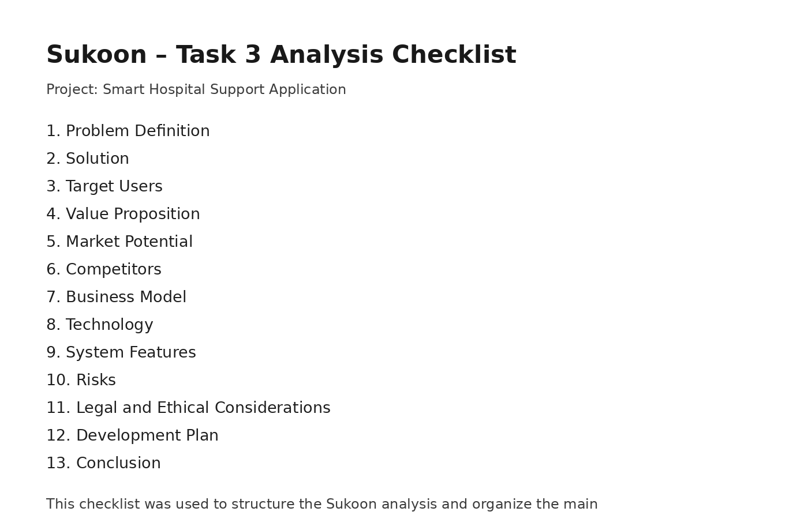

# Task 3 – Analysis

## Project

**Sukoon – Smart Hospital Support Application**

Sukoon is a digital health startup concept designed to improve the hospital experience for patients and visitors. The platform supports users through hospital navigation, appointment support, reminders, multilingual guidance, and emotional support features.

---

## 1. Problem Definition

Hospitals are often stressful, confusing, and overwhelming environments. Patients and visitors may face several challenges during a hospital visit, such as:

- Difficulty navigating inside large hospital buildings
- Missed or delayed appointments
- Limited guidance for visitors and international patients
- Lack of emotional support during stressful situations
- Poor communication between patients, visitors, and hospital services

These problems can increase anxiety, reduce patient satisfaction, and create additional pressure on hospital staff.

---

## 2. Solution

Sukoon provides a smart digital platform that supports patients and visitors before and during their hospital visit.

The platform can include:

- Indoor hospital navigation
- Appointment support and reminders
- Multilingual guidance
- Emotional support features
- General hospital information
- Clear redirection to staff or reception when needed

The main goal is to create a calmer, clearer, and more supportive hospital experience.

---

## 3. Target Users

The main target users are:

- Patients
- Hospital visitors
- Elderly users
- International patients
- Family members and caregivers

These user groups often need clear, simple, and reliable information during hospital visits.

---

## 4. Value Proposition

Sukoon offers value by improving the hospital experience for both users and healthcare organizations.

For patients and visitors, Sukoon provides:

- Reduced stress
- Better orientation inside the hospital
- Clearer appointment information
- Easier access to support

For hospitals, Sukoon can support:

- Improved patient satisfaction
- Reduced pressure on reception staff
- Better communication
- More efficient patient flow
- A stronger digital health service experience

---

## 5. Market Potential

Digital health is becoming increasingly important as hospitals invest in patient experience, digital transformation, and service efficiency. Many healthcare organizations are looking for solutions that improve communication, reduce waiting stress, and make hospital services easier to access.

Sukoon fits into this market because it focuses on a practical problem inside hospitals: helping patients and visitors feel less lost, less stressed, and better informed.

The concept could be relevant for:

- Hospitals
- University clinics
- Private clinics
- Outpatient centers
- Healthcare service providers

---

## 6. Competitors

Existing solutions may include:

- Hospital apps with limited features
- General navigation apps
- Appointment booking systems
- Information desks and hospital websites

However, many of these solutions focus on one specific function only. Sukoon differentiates itself by combining hospital navigation, appointment support, multilingual guidance, and emotional support in one healthcare-specific concept.

---

## 7. Business Model

Possible revenue streams for Sukoon include:

- B2B subscription model for hospitals
- Software licensing
- Premium feature packages
- Custom implementation for healthcare providers
- Maintenance and support contracts

The most realistic model would be a B2B approach, where hospitals or clinics pay for the platform as part of their digital patient experience strategy.

---

## 8. Technology

Sukoon could be developed using the following technologies:

- Mobile app interface
- Web-based dashboard
- Cloud backend
- Database system for hospital departments and appointments
- Notification system for reminders
- Chat-based support interface
- Secure authentication and user management

For a first prototype, the system can start with simple features such as department search, appointment reminders, and basic support messages. Later versions can include more advanced integrations.

---

## 9. System Features

Main features of Sukoon may include:

- Department and room search
- Indoor navigation guidance
- Appointment reminder messages
- Multilingual support
- Visitor guidance
- Emotional support messages
- Hospital information page
- Feedback option after the visit

These features are designed to support both the practical and emotional needs of hospital users.

---

## 10. Risks

The main risks of the project are:

- Data privacy issues
- Hospital integration challenges
- Incorrect or outdated information
- Low user adoption
- Technical maintenance requirements
- Accessibility challenges for elderly users

Because Sukoon is connected to healthcare, privacy, reliability, and clear communication are especially important.

---

## 11. Legal and Ethical Considerations

Sukoon would need to consider legal and ethical requirements, especially if future versions handle personal or health-related data.

Important considerations include:

- GDPR compliance
- Patient data protection
- Secure storage of user information
- Clear limitation of support features
- No replacement of medical professionals
- Transparent communication with users

The system should support users with orientation and general guidance, but it should not provide medical diagnosis or replace professional medical advice.

---

## 12. Development Plan

The product can be developed in phases:

### Phase 1 – MVP

- Basic navigation support
- Department search
- Simple appointment reminders
- Basic user interface

### Phase 2 – Core Platform

- Improved appointment support
- Multilingual guidance
- Visitor information
- Feedback feature

### Phase 3 – Advanced Support

- Chat-based support
- More personalized guidance
- Hospital dashboard
- Integration with hospital systems

### Phase 4 – Testing and Launch

- User testing
- Hospital pilot project
- Privacy and security review
- Final improvements before launch

---

## 13. Conclusion

Sukoon is a realistic digital health software concept that addresses a clear problem in hospitals. It focuses on improving the patient and visitor experience by reducing confusion, supporting navigation, improving communication, and creating a calmer hospital visit.

The project combines software engineering with healthcare management because it considers both technical development and hospital service quality. With a phased development approach, Sukoon can start as a simple prototype and later grow into a more complete hospital support platform.

## Evidence

The analysis was structured using a practical startup analysis checklist. The checklist helped organize the main points of the Sukoon project in a clear order.

