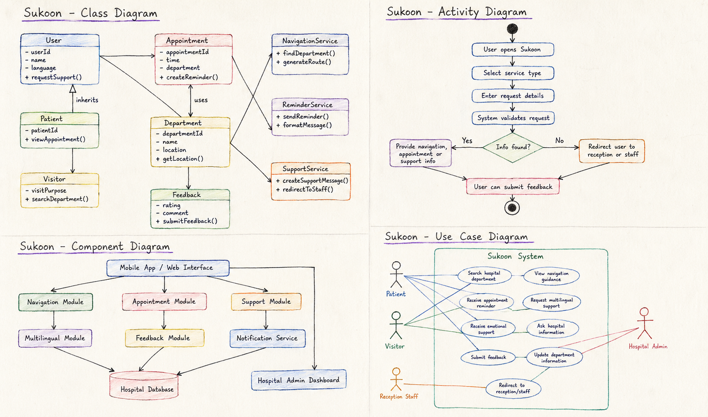

# Task 4 – UML

## Goal

The goal of this task is to create UML diagrams for the Sukoon project. The diagrams show the system from different perspectives: users, structure, components, and process flow.

The class diagram is mandatory. For this task, four UML diagrams were prepared:

1. Class Diagram
2. Activity Diagram
3. Component Diagram
4. Use Case Diagram

The diagrams were drawn and exported as one combined image file.

## Project Context

Sukoon is a smart hospital support application for patients and visitors. The system supports users with hospital navigation, appointment reminders, multilingual guidance, emotional support features, and general hospital information.

The UML diagrams help explain how the system works and how the main parts are connected.

## UML Diagrams

The following image contains the four UML diagrams prepared for the Sukoon project:

1. Class Diagram
2. Activity Diagram
3. Component Diagram
4. Use Case Diagram

## Diagram Explanation

The Class Diagram shows the main classes of the system, such as User, Patient, Visitor, Appointment, Department, Feedback, NavigationService, ReminderService, and SupportService.

The Activity Diagram shows the basic user flow. The user opens Sukoon, selects a service, enters request details, and receives either support information or redirection to reception or staff.

The Component Diagram shows the main technical parts of the system, including the mobile or web interface, navigation module, appointment module, support module, multilingual module, feedback module, notification service, hospital database, and hospital admin dashboard.

The Use Case Diagram shows the main actors and interactions. The actors include Patient, Visitor, Reception Staff, and Hospital Admin. The use cases include searching for a hospital department, receiving appointment reminders, requesting multilingual support, receiving emotional support, submitting feedback, and updating department information.

## Reflection

The UML diagrams helped structure the Sukoon idea in a more technical way. Instead of only describing the application in text, the diagrams show how users interact with the system, what classes are needed, which components are involved, and how the process flow works.
