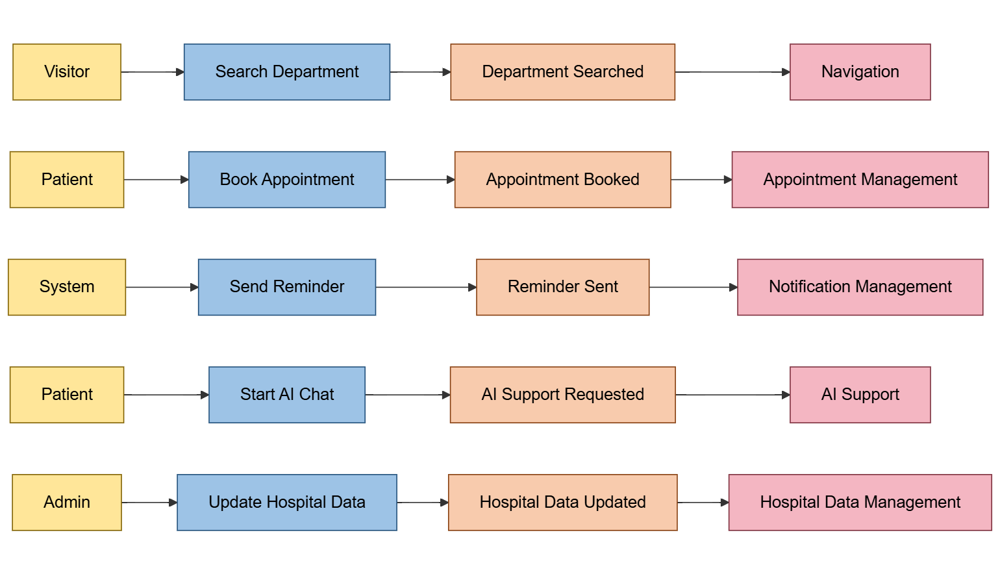
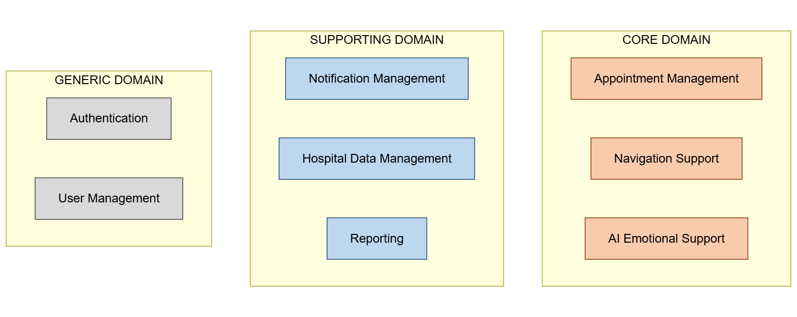
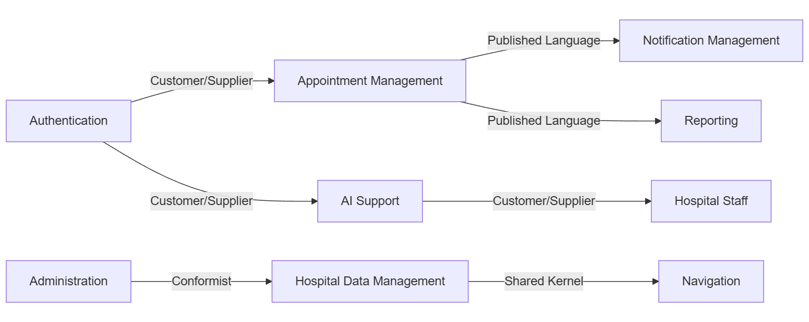

# Task 5 – Domain-Driven Design (DDD)

## Project

Sukoon – Smart Hospital Support Application

For this task, I applied Domain-Driven Design to my Sukoon project.

I created:

* Event Storming
* Core Domain Chart
* Domain Mapping
* Bounded Context Canvas

---

## A – Event Storming

---

## B – Core Domain Chart

---

## C – Domain Mapping

---

## D – Bounded Context Canvas

---

## My Experience

This task helped me understand that Sukoon is not one single simple app, but a system with multiple domains.

I identified the main domains such as Appointment Management, Navigation, AI Support, Notification Management, and Authentication.

The most important domain is Appointment Management because it connects users, appointments, reminders, and hospital staff.
