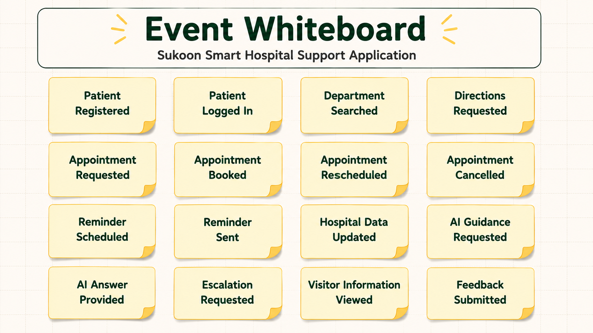
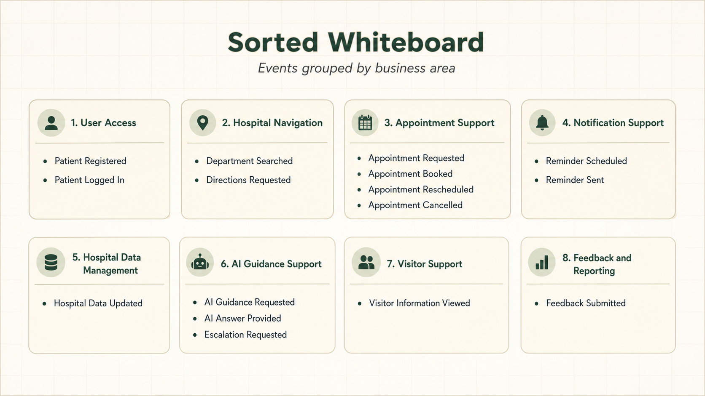
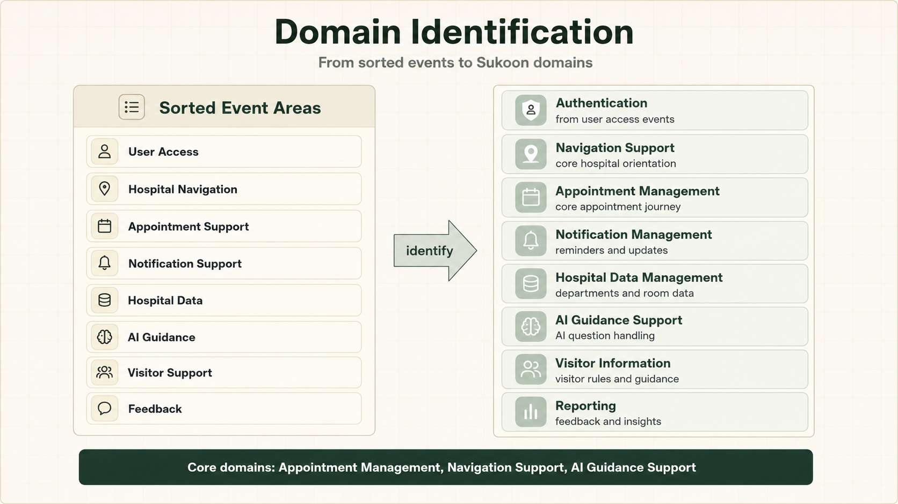
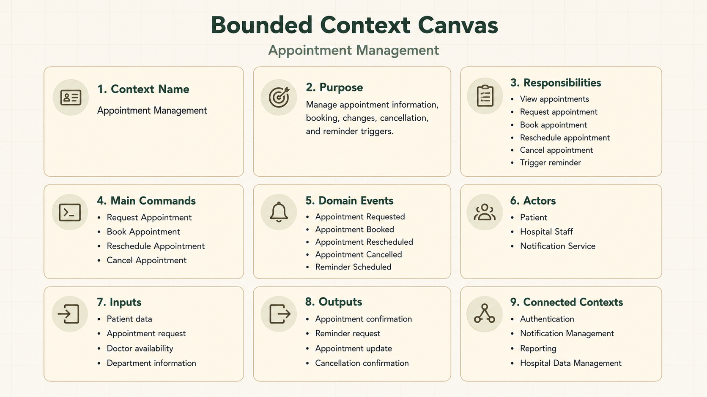

# Task 5 – Domain-Driven Design

## Project

Sukoon – Smart Hospital Support Application

For this task, I applied Domain-Driven Design to the Sukoon project. Sukoon is a digital hospital support application for patients and visitors. The goal of the DDD work is to understand the main business areas of the system and to separate them into meaningful domains.

This task contains the following parts:

1. Event Whiteboard
2. Sorted Whiteboard
3. Domain Identification
4. Core Domain Chart
5. Domain Mapping
6. Bounded Context Canvas

## A – Event Storming

The Event Storming was revised to follow the correct DDD structure.

Instead of creating a process flow with actors, commands, events, and domains in one line, I separated the work into three steps:

1. Event Whiteboard
2. Sorted Whiteboard
3. Domain Identification

The purpose of the first step is to collect domain events only. Events describe something that already happened in the domain. For this reason, the events are written in past tense.

## A1 – Event Whiteboard

The Event Whiteboard collects possible domain events for the Sukoon system without sorting them yet.

Examples of events used in this step:

```text
Patient Registered
Patient Logged In
Department Searched
Directions Requested
Appointment Requested
Appointment Booked
Appointment Rescheduled
Appointment Cancelled
Reminder Scheduled
Reminder Sent
Hospital Data Updated
AI Guidance Requested
AI Answer Provided
Escalation Requested
Visitor Information Viewed
Feedback Submitted
```

These are events because they describe something that happened in the system or in the hospital support process.



## A2 – Sorted Whiteboard

After collecting the events, I sorted them into meaningful groups. This helped me see which parts of the Sukoon system belong together.

The sorted areas are:

```text
User Access
Hospital Navigation
Appointment Support
Notification Support
Hospital Data Management
AI Guidance Support
Visitor Support
Feedback and Reporting
```

This step helped me move from a raw event collection to a clearer domain structure.



## A3 – Domain Identification

From the sorted events, I identified the main domains of Sukoon.

The identified domains are:

```text
Authentication
Navigation Support
Appointment Management
Notification Management
Hospital Data Management
AI Guidance Support
Visitor Information
Reporting
```

The most important domains for the product are Appointment Management, Navigation Support, and AI Guidance Support, because they create the main value for patients and visitors.



## B – Core Domain Chart

The Core Domain Chart separates the domains into Core Domain, Supporting Domain, and Generic Domain.

The Core Domain contains the parts that make Sukoon valuable and different. The Supporting Domain contains important helper areas. The Generic Domain contains common functions that many applications need.


## Core Domain

The core domains are:

```text
Appointment Management
Navigation Support
AI Guidance Support
```

Appointment Management is central because patients often use Sukoon to understand and manage appointment-related information.

Navigation Support is central because one of the main problems Sukoon solves is helping patients and visitors find the right place inside the hospital.

AI Guidance Support is central in the advanced version because it helps users ask questions in natural language and receive structured hospital guidance.

## Supporting Domain

The supporting domains are:

```text
Notification Management
Hospital Data Management
Reporting
Visitor Information
```

These domains support the core product. They are important, but they do not create the main value alone.

## Generic Domain

The generic domains are:

```text
Authentication
User Management
```

These are needed in many software systems and are not unique to Sukoon.

## C – Domain Mapping

The Domain Mapping shows how the domains depend on each other and how they communicate.


The most important relationships are:

```text
Authentication -> Appointment Management
Authentication -> AI Guidance Support
Appointment Management -> Notification Management
Appointment Management -> Reporting
Hospital Data Management -> Navigation Support
AI Guidance Support -> Hospital Staff Escalation
Administration -> Hospital Data Management
```

The mapping helped me understand that some domains provide information to others. For example, Hospital Data Management provides department and room information to Navigation Support. Appointment Management triggers notifications and also provides useful information for reporting.

## D – Bounded Context Canvas

For the Bounded Context Canvas, I focused on the Appointment Management context because it is one of the core areas of the Sukoon system.

The canvas is provided as one image with text inside the diagram.



## Bounded Context: Appointment Management

The Appointment Management context is responsible for managing appointment-related actions inside Sukoon.

It includes:

```text
Viewing appointment information
Requesting an appointment
Booking an appointment
Rescheduling an appointment
Cancelling an appointment
Triggering appointment reminders
Providing appointment updates
```

This context connects with Authentication, Notification Management, Reporting, and Hospital Data Management.

Authentication identifies the user. Notification Management sends reminders. Reporting receives appointment-related data for service improvement. Hospital Data Management provides department and location information connected to the appointment.

## Personal Understanding

This task helped me understand that Sukoon is not one single block of software. It has different business areas that should be separated.

The Event Storming helped me identify what happens in the system. The Sorted Whiteboard helped me group these events. The Domain Identification helped me find the main domains. The Core Domain Chart helped me decide which domains create the most value. The Domain Mapping helped me understand relationships between the domains. The Bounded Context Canvas helped me describe one important context in more detail.

The most important correction was understanding that Event Storming should start with real domain events, not with a flowchart of actors, commands, and domains.
