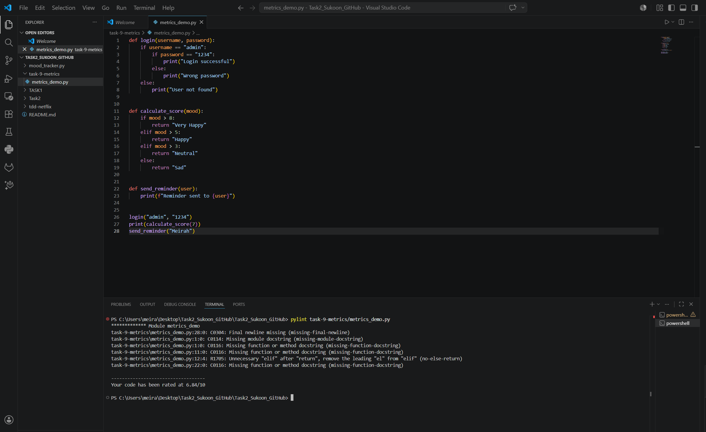
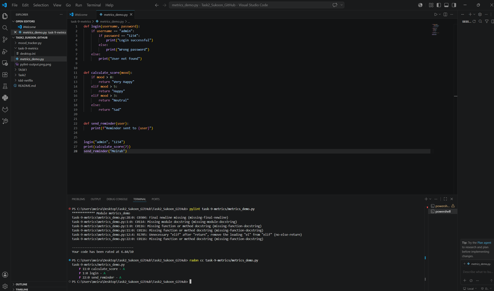
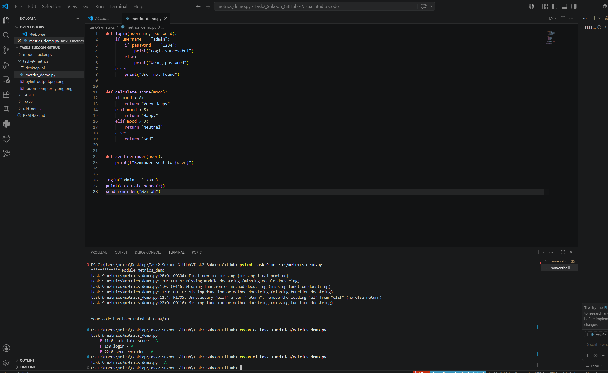

# Task 11 – Metrics
## Project
Sukoon – Smart Hospital Support Application

For this task, I used software metrics tools to analyze code quality and maintainability.

## Task Description
The goal of this task was to apply software metrics and code quality analysis techniques to evaluate a Python program. For this task, I analyzed the code using software metrics tools to measure maintainability, complexity, and detect possible coding issues. I used Pylint and Radon, documented the results with screenshots, and reflected on what I learned from the analysis process.

## Tools Used

### Pylint
Pylint was used to analyze coding style and detect possible issues.

Result:
- Code rating: 6.84/10
- Missing documentation comments
- Missing final newline
- Some unnecessary code structures

Screenshot:

---

### Radon Complexity

Radon was used to calculate Cyclomatic Complexity.

Result:
- calculate_score → A
- login → A
- send_reminder → A

Screenshot:

---

### Radon Maintainability

Radon was used to measure maintainability.

Result:
- Maintainability Index: A

Screenshot:

---

## Reflection

The metrics analysis helped me understand how code quality can be measured automatically. I learned that even if the program works correctly, tools can identify areas for improvement such as documentation and structure.
