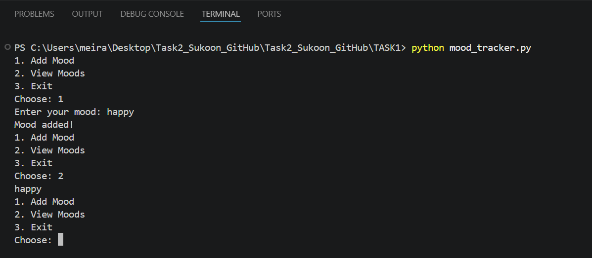
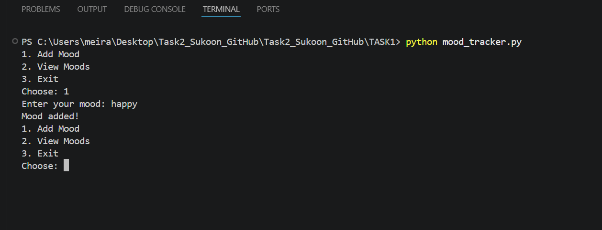
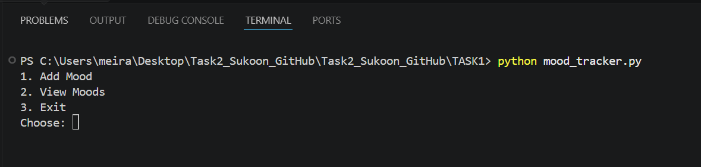

# Task A – Mood Tracker

This is a simple Python program where I track moods.

## What I did
- I created a small program
- User can add mood
- User can view moods

## My experience
At first I didn’t know how to store moods, but I used a list and it worked.

## Run
python mood_tracker.py
## Screenshots

### Run

### Add Mood

### View Mood

